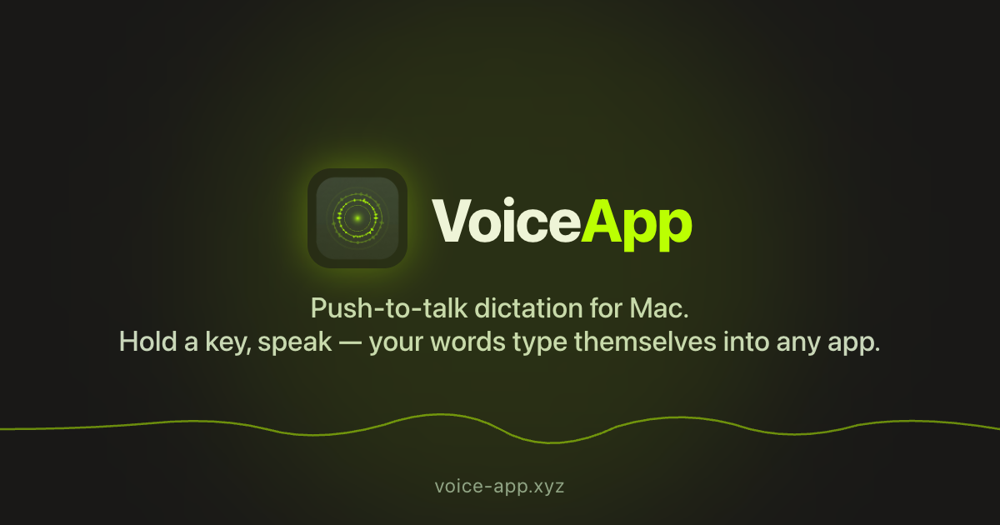
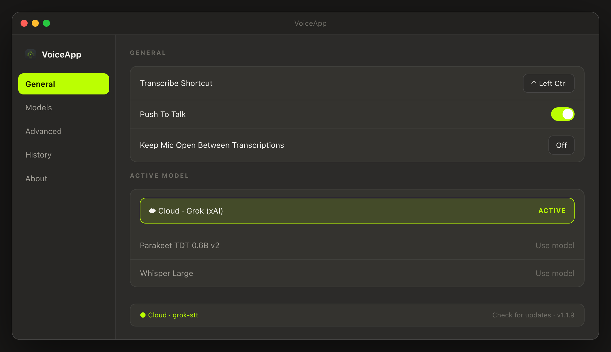
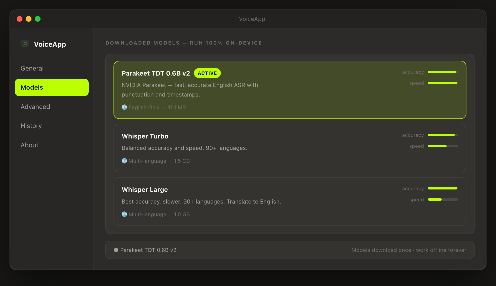

# VoiceApp

<p align="center">
  
</p>

<p align="center">
  <a href="https://voice-app.xyz/"><strong>Website</strong></a>
  ·
  <a href="https://github.com/DistinctZA/voiceapp-releases/releases/latest"><strong>Download for macOS</strong></a>
  ·
  <a href="https://github.com/DistinctZA/voiceapp-releases/releases"><strong>All releases</strong></a>
</p>

**VoiceApp** is a free, open-source macOS menu-bar app for local speech-to-text. Press a hotkey, speak, and transcribed text is typed into the app in focus — no cloud required.

VoiceApp is built and maintained by [DistinctZA](https://github.com/DistinctZA). It is inspired by and derived from [Handy](https://github.com/cjpais/Handy), created by [CJ Pais](https://github.com/cjpais). Thank you to CJ Pais and the Handy contributors for the open-source foundation that made VoiceApp possible.

**Free to use under the [MIT license](LICENSE).** No subscription, trial expiry, license key, or activation required. Optional cloud transcription uses your own provider API key; any provider usage charges are separate.

| | |
|---|---|
| **Version** | 1.4.0 |
| **Bundle ID** | `com.distinctza.voiceapp` |
| **Platform** | macOS (Apple Silicon) |
| **Accent color** | `#bbff02` (lime green) |
| **Menu bar icon** | Voice pulse rings (template icon) |

---

## See it in action

<table>
  <tr>
    <td width="50%"></td>
    <td width="50%"></td>
  </tr>
  <tr>
    <td align="center"><strong>Configure your shortcut and active model</strong></td>
    <td align="center"><strong>Choose local Parakeet or Whisper models</strong></td>
  </tr>
</table>

---

## Features

- **Menu bar app** — lives in the tray; optional main settings window
- **Local transcription** — models run on-device with Metal acceleration on Apple Silicon
- **Hotkey dictation** — push-to-talk or hands-free modes
- **Onboarding** — permissions setup, model download, and first-run guidance
- **Model management** — download, switch, and delete models from onboarding or **Settings → Models**
- **Active model selector** — quick switching between downloaded models in **Settings → General**
- **Transcription history** — optional recording retention and history browsing
- **Post-processing** — optional LLM cleanup of transcripts (when enabled in settings)

---

## Supported models

VoiceApp ships a curated catalog of **Parakeet** and **Whisper** models only.

### Recommended default

**Parakeet TDT 0.6B v2** ([NVIDIA](https://huggingface.co/nvidia/parakeet-tdt-0.6b-v2)) — fast, accurate English ASR with punctuation and timestamps (~451 MB).

### Parakeet

| Model | Languages | Size |
|-------|-----------|------|
| Parakeet TDT 0.6B v2 | English | ~451 MB |
| Parakeet V3 | 25 European languages | ~456 MB |

### Whisper

| Model | Languages | Size |
|-------|-----------|------|
| Whisper Small | 90+ | ~465 MB |
| Whisper Medium | 90+ | ~469 MB |
| Whisper Turbo | 90+ | ~1.5 GB |
| Whisper Large | 90+ | ~1.0 GB |

Custom Whisper `.bin` files dropped into the models folder are still discovered automatically.

---

## Install the app

The easiest route is through the **[VoiceApp website](https://voice-app.xyz/)**:

1. Click **Download for Free** on the website, or download the latest `.dmg` directly from [GitHub Releases](https://github.com/DistinctZA/voiceapp-releases/releases/latest).
2. Open the DMG and drag **VoiceApp** into **Applications**.
3. Right-click VoiceApp and choose **Open** the first time if macOS blocks the unsigned app.
4. Grant **Microphone** and **Accessibility** access during onboarding.

Released builds update themselves from the public [`voiceapp-releases`](https://github.com/DistinctZA/voiceapp-releases) repository.

---

## Build prerequisites

- **macOS** on Apple Silicon
- [Xcode Command Line Tools](https://developer.apple.com/xcode/)
- [Rust](https://rustup.rs/)
- [Bun](https://bun.sh/)
- **cmake** (required for native deps): `brew install cmake`

---

## Development

Clone the repo, install dependencies, and run the dev build:

```bash
git clone https://github.com/DistinctZA/voice-app.git
cd voice-app
bun install
CMAKE_POLICY_VERSION_MINIMUM=3.5 bun run tauri dev
```

The app appears in the menu bar as **VoiceApp v1.4.0 (Dev)**. The Vite frontend runs at `http://localhost:1420/`.

### macOS permissions (dev builds)

Development runs the raw binary at `src-tauri/target/debug/voiceapp`, not a signed `.app` bundle. macOS ties Accessibility access to the binary path, so permissions may need to be re-granted after rebuilds.

1. Open **System Settings → Privacy & Security → Accessibility**
2. Click **+** and add `voiceapp` from Finder (**Show app in Finder** is available in the onboarding screen)
3. Remove previous `voiceapp` entries if they no longer work
4. Quit VoiceApp completely and reopen after granting access

Microphone access is requested separately during onboarding.

---

## Install from source

Use the install script to pull the latest code from GitHub, build a release `.app`, and copy it to **Applications**. Each run checks for repository updates before building. The prerequisites above are only needed for this source-build method.

### First-time setup

```bash
git clone https://github.com/DistinctZA/voice-app.git
cd voice-app
bun install
./scripts/install.sh
```

**Double-click install (macOS):** In Finder, open the VoiceApp folder and double-click **`Install VoiceApp.command`**. Terminal opens, runs the installer, and waits for you to press Enter before closing. On first use, you may need to right-click → **Open** if macOS blocks unsigned scripts.

Or via npm script:

```bash
bun run install:mac
```

The script will:

1. **Fetch** `origin/main` and report if new commits are available  
2. **Pull** latest changes (asks for confirmation, or use `-y`)  
3. **Build** `VoiceApp.app` (skipped if already installed at the same version + commit, unless `--force`)  
4. **Install** to `/Applications/VoiceApp.app`  
5. Record install metadata in `~/Library/Application Support/com.distinctza.voiceapp/.install-meta`

**First launch:** If macOS blocks the unsigned app, right-click **VoiceApp.app → Open**. Grant **Microphone** and **Accessibility** during onboarding.

### Check for updates (no build)

```bash
./scripts/install.sh --check
```

### Install script options

Run from Terminal as `./scripts/install.sh`, or double-click **`Install VoiceApp.command`** in the project folder (same script, with a pause at the end).

| Flag | Description |
|------|-------------|
| *(none)* | Pull if needed, build if version/commit changed, install |
| `--check` | Only show whether an update is available |
| `--force` | Rebuild and reinstall even if version matches |
| `--no-pull` | Build from current local checkout without `git pull` |
| `-y` | Pull without confirmation prompt |

---

## Managing updates

Packaged builds check the [public release feed](https://github.com/DistinctZA/voiceapp-releases/releases) for updates. Source installations update through **git + reinstall**:

### Maintainer release flow

1. Make your code changes on `main`
2. Bump the version everywhere:
   ```bash
   ./scripts/bump-version.sh 1.4.1
   ```
   This updates `package.json`, `src-tauri/tauri.conf.json`, and `src-tauri/Cargo.toml`.
3. Commit and push:
   ```bash
   git add package.json src-tauri/tauri.conf.json src-tauri/Cargo.toml
   git commit -m "Release VoiceApp 1.4.1"
   git push
   ```
4. On the configured release Mac, build, sign, install, and publish:
   ```bash
   ./scripts/install.sh --force
   ```

The source-repository workflow creates the version tag. The release script uploads the customer-facing DMG, signed updater archive, and `latest.json` feed to [`DistinctZA/voiceapp-releases`](https://github.com/DistinctZA/voiceapp-releases/releases).

### Updating a source installation

```bash
cd voice-app
./scripts/install.sh
```

The script detects that the remote has new commits, pulls them, sees the version changed (or commit hash changed), rebuilds, and replaces `/Applications/VoiceApp.app`.

Your models and settings in `~/Library/Application Support/com.distinctza.voiceapp/` are **preserved** across updates.

### Version numbering

Use semantic versions: `MAJOR.MINOR.PATCH` (e.g. `1.4.0` → `1.4.1` → `1.5.0`). The menu bar shows the version from the built app (e.g. **VoiceApp v1.4.1**).

---

## Production build (manual)

```bash
CMAKE_POLICY_VERSION_MINIMUM=3.5 bun run tauri build
```

Built artifacts are written under `src-tauri/target/release/bundle/macos/VoiceApp.app`. Prefer `./scripts/install.sh` instead — it builds and installs in one step.

---

## Data & logs

| Path | Contents |
|------|----------|
| `~/Library/Application Support/com.distinctza.voiceapp/` | App data root |
| `…/models/` | Downloaded transcription models |
| `…/history.db` | Transcription history |
| `…/voiceapp.log` | Application log |

---

## Project structure

```
VoiceApp/
├── src/                    # React + TypeScript UI
│   ├── components/         # Settings, onboarding, model selector
│   ├── assets/             # App and tray icon SVGs
│   └── lib/constants/      # Model catalog filters, shared constants
├── src-tauri/              # Rust backend (Tauri)
│   ├── src/managers/       # Audio, models, transcription, history
│   ├── resources/          # Tray icons, sounds, default settings
│   └── icons/              # Bundle icons (.icns, .ico, platform sizes)
└── public/                 # Static assets (favicon, icons)
```

---

## Branding & icons

- **UI accent:** `#bbff02` — progress bars, badges, toggles, and highlights
- **Menu bar tray:** black sound-waves template icon (`src/assets/tray-sound-waves.svg`)
- **Dock / bundle icon:** sound waves on lime green background (`src/assets/app-icon.svg`)

To regenerate bundle icons after changing `src/assets/app-icon.svg`:

```bash
/opt/homebrew/bin/rsvg-convert -w 1024 -h 1024 src/assets/app-icon.svg -o src/assets/app-icon.png
bunx tauri icon src/assets/app-icon.png
```

To regenerate tray PNGs:

```bash
RSVG=/opt/homebrew/bin/rsvg-convert
$RSVG -w 44 -h 44 src/assets/tray-sound-waves.svg -o src-tauri/resources/tray_idle.png
cp src-tauri/resources/tray_idle.png src-tauri/resources/tray_idle_dark.png
$RSVG -w 32 -h 32 src/assets/tray-sound-waves.svg -o src-tauri/resources/voiceapp.png
```

---

## Git remote

```bash
git remote -v
# origin  git@github.com:DistinctZA/voice-app.git
```

Use your SSH config alias if configured (e.g. `github.com-personal` for DistinctZA).

---

## Upstream

VoiceApp is derived from [Handy](https://github.com/cjpais/Handy) by CJ Pais (MIT). Whisper models download from the official [whisper.cpp](https://huggingface.co/ggerganov/whisper.cpp) mirror; Parakeet bundles are still served from the upstream CDN pending re-hosting.

**License:** MIT (see LICENSE; includes upstream attribution)
